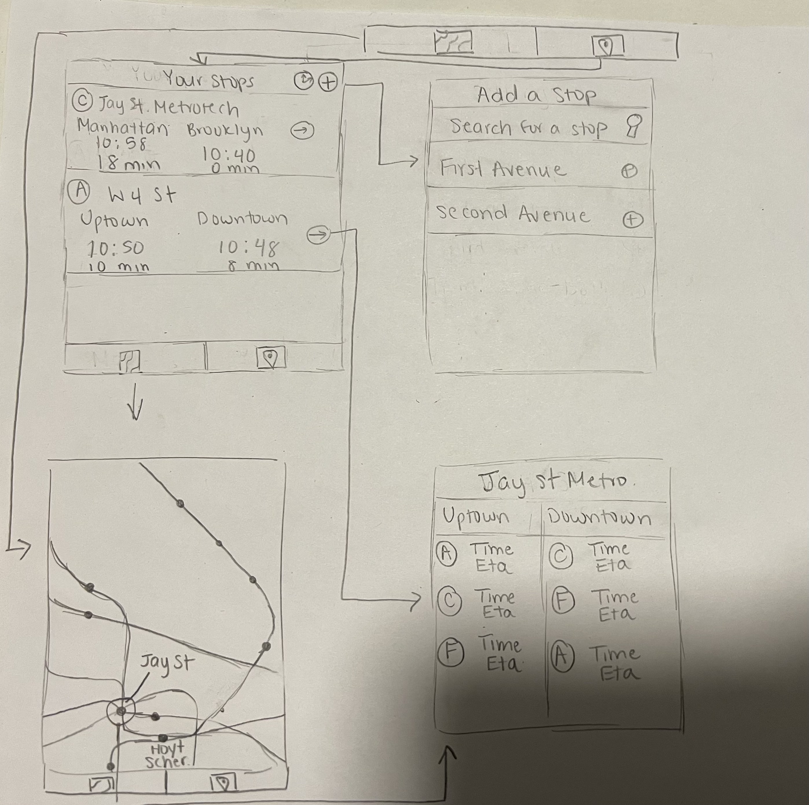

# Yourway
## Table of Contents
1. Overview
1. Product Spec
1. Wireframes
1. Schema
1. Overview
1. Description
Yourway is designed to fit your schedule, tracking the subway lines that you ride the most. The app allows you to add subway lines in order to easily view schedules and updates.

App Evaluation
    - Category: Travel
    - Mobile: People in NY regularly use their phone to search up subway lines and times. Tracking subways requires maps and user location to provide decisions on which subway to take.
    - Story: Allows users to easily access subway times of their regular commutes without having to search it up.
    - Market: NYC subway riders
    - Habit: Daily, since subway riders usually have to ride the subway to every location.
    - Scope: V1 would allow users to add subway stations they regularly use. V2 would add a subway map (kind of like Underway) that has all the subway stops and the ability to view the times of the stops.
    
Product Spec
1. User Stories (Required and Optional)
Required Must-have Stories

- User can search for subway stops
- User can add subway stops
- User can delete subway stops
- User can see view schedules of their subway line for their stop
    - What time the subway comes, and how many minutes until it comes
- User can toggle between time of subway arrival, estimated time of arrival (in minutes), or both

Optional Nice-to-have Stories
- User can view the entire subway map and each station's schedules.
- User can get notifications to leave in 5 minutes, in 2 minutes, etc.

2. Screen Archetypes
- Subway Stops Screen (Main)
    - User can view their commonly used subway lines and the time of the next subway coming
- Stop's Schedule Screen
    - User can view the schedule of the stop 
- Settings Screen
    - User can search for subway lines to add to their main screen
- Subway Map Screen
    - User can view all stops in NYC subway system
3. Navigation
Tab Navigation (Tab to Screen)
- Subway stops
- Settings
- Subway map

Flow Navigation (Screen to Screen)
- Subway stops
    - => Stop's schedule

- Settings
    - => Subway stops

- Subway map
    - => Stop's schedule

- Stop's schedule
    - Depends on what was clicked
    - From subway stops
        - => Subway stops 
    - From subway map
        - -> Subway map

Wireframes

Week 1
- Added layout, including view controllers and tab view controller
- No challenges; just needed to refer back to past lectures to implement tab controller
- Next steps: add backend and implement table view for stops

[Demo](https://imgur.com/a/iMp6qlh)

[BONUS] Digital Wireframes & Mockups
[BONUS] Interactive Prototype

Schema
[This section will be completed in Unit 9]

Models
[Add table of models]

Networking
[Add list of network requests by screen ]
[Create basic snippets for each Parse network request]
[OPTIONAL: List endpoints if using existing API such as Yelp]
