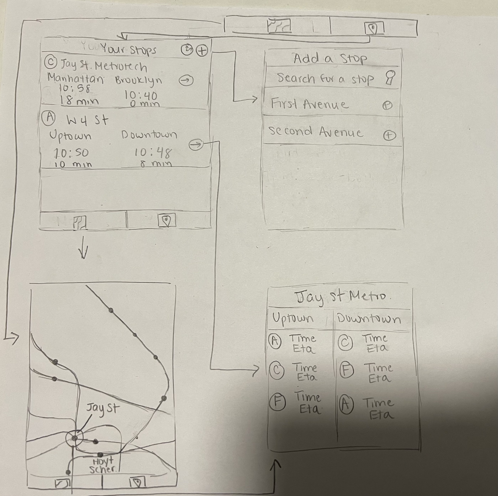
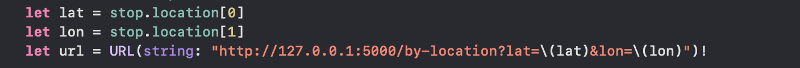
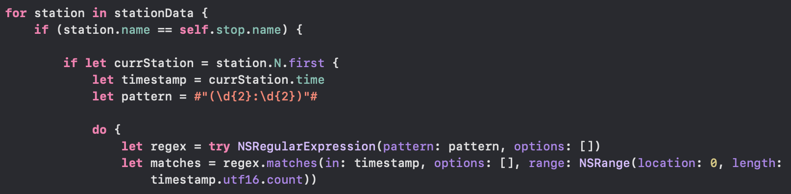

# Yourway
## Table of Contents
1. [Overview](#overview)
1. [Product Spec](#product-spec)
1. [Wireframes](#wireframes)
1. [Schema](#schema)
1. [Sprints](#sprints)
1. [Final ish Demo](#final-ish-demo)

### Overview
#### 1. Description:
Yourway is designed to fit your schedule, tracking the subway lines that you ride the most. The app allows you to add subway lines in order to easily view schedules and updates.

#### 2. App Evaluation
- Category: Travel
- Mobile: People in NY regularly use their phone to search up subway lines and times. Tracking subways requires maps and user location to provide decisions on which subway to take.
- Story: Allows users to easily access subway times of their regular commutes without having to search it up.
- Market: NYC subway riders
- Habit: Daily, since subway riders usually have to ride the subway to every location.
- Scope: V1 would allow users to add subway stations they regularly use. V2 would add a subway map that has all the subway stops and the ability to view the times of the stops.
    
### Product Spec
#### 1.1 User Stories (Required and Optional)
Required Must-have Stories

- [x] User can see view schedules of their subway line for their stop
    - What time the subway comes, and how many minutes until it comes
- [x] User can see both downtown and uptown schedules
- [x] User can search for stops and add them
- [x] User can delete stops

#### 1.2 Optional Nice-to-have Stories
- [x] User can toggle between time of subway arrival, estimated time of arrival (in minutes), or both
- [ ] User can view the entire subway map and each station's schedules.
- [ ] User can get notifications to leave in 5 minutes, in 2 minutes, etc.

#### 2. Screen Archetypes
- Subway Stops Screen (Main)
    - User can view their commonly used subway lines and the time of the next subway coming
- Stop's Schedule Screen
    - User can view the schedule of the stop 
- Settings Screen
    - User can search for subway lines to add to their main screen
- Subway Map Screen
    - User can view all stops in NYC subway system
 
#### 3. Navigation
Tab Navigation (Tab to Screen)
- Subway stops
- Settings
- Subway map

Flow Navigation (Screen to Screen)
- Subway stops
    - => Stop's schedule

- Settings
    - => Subway stops

- Subway map
    - => Stop's schedule

- Stop's schedule
    - Depends on what was clicked
    - From subway stops
        - => Subway stops 
    - From subway map
        - -> Subway map

### Wireframes



### Schema

Models
```
struct Stop : Decodable {
    let data : [SubwayStation]
}

struct RouteData : Decodable  {
    let route : String
    let time : String
}

struct SubwayStation : Decodable {
    let N : [RouteData]
    let S : [RouteData]
    let routes : [String]
    let lastUpdate : String
    let id : String
    let location : [Double]
    let name : String
    let stops : [String: [Double]]
    
    enum CodingKeys: String, CodingKey {
        case N
        case S
        case routes
        case lastUpdate = "last_update"
        case id
        case location
        case name
        case stops
    }
}
```

Networking
- DetailViewController
    - `stop`, the station the information is requested for, is passed into the DetailViewController
    - Request is made using [MTAPI](https://github.com/jonthornton/MTAPI) by passing in the station's latitude and longitude from `stop.location` using the endpoint `/by-location?lat=[latitude]&lon=[longitude]`
    - Endpoint returns the 5 stations nearest the provided lat/lon pair.
    - Request returns a JSON object that contains trains that run at the nearest 5 stops
    - For the stops that match the stop's name, we find the next train (currently just N) and parse the times




### Sprints
#### Week 1
- Added layout, including view controllers and tab view controller
- No challenges; just needed to refer back to past lectures to implement tab controller
- Next steps: add backend and implement table view for stops

[Demo](https://imgur.com/a/iMp6qlh)

#### Week 2
- Added API call and backend 
- Fix UI
- Implemented table view

[Demo](https://imgur.com/a/Dx9o9IJ)

### Week 3
- Added both north and south direction at subway stops
- Added a map for user if user wants to see a whole map
- Next steps: Add rest of the stops in database and add search functionality

[Demo](https://imgur.com/a/5RqyJoW)

### Final ish Demo

[Demo](https://imgur.com/a/YKlVET7)
